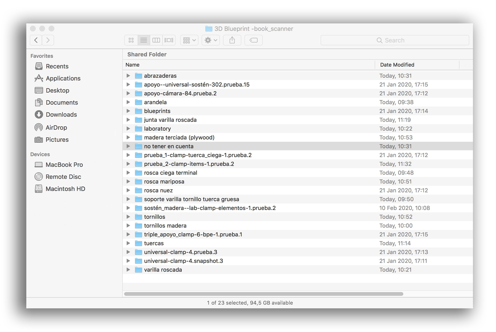
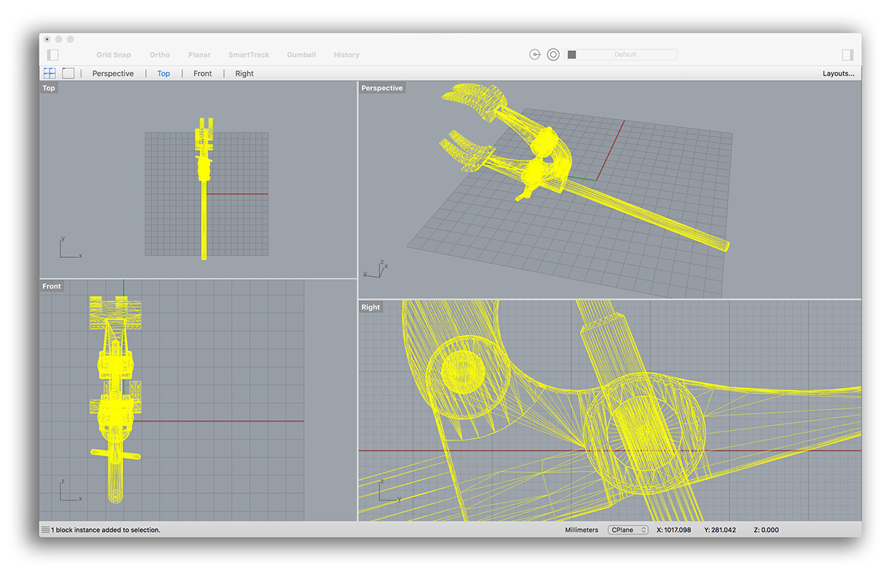
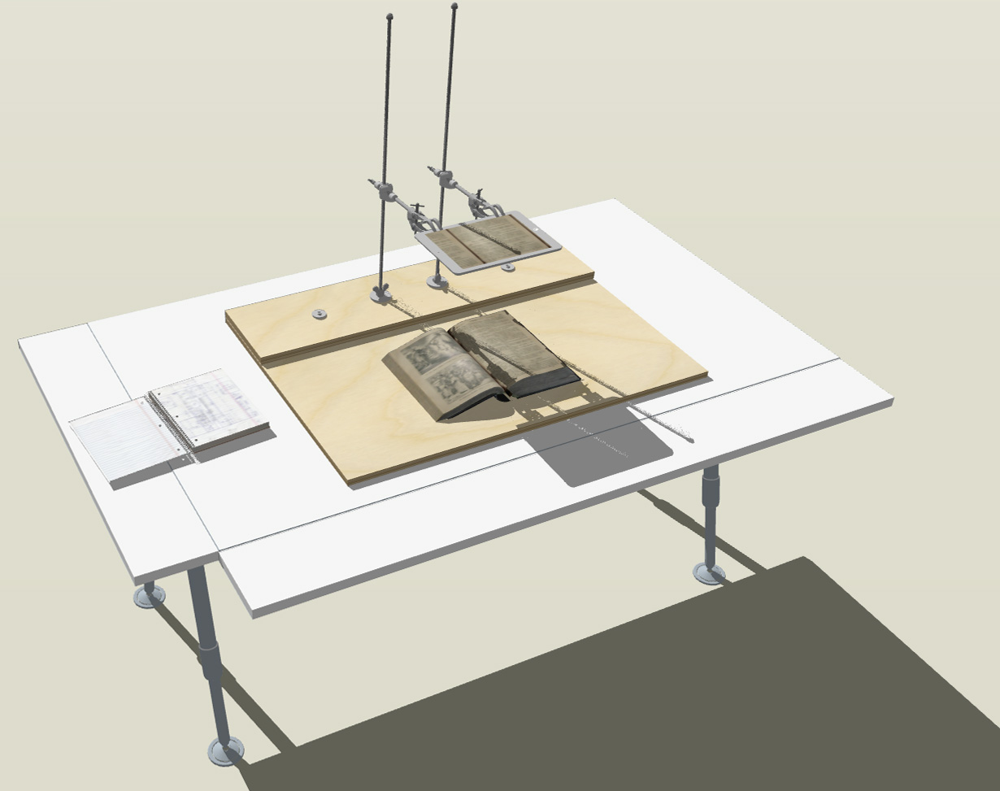

  

# RATIONALE #

* This internal project reflects our needs to digitize analogous data to the digital realm.
* There were some insights and failures in the process, but, we reached the goal: not too pricey, technically affordable and easy to transport and deploy.
* This repo is a living document that will grow and adapt over time
   
 

### What is this repository for? ###

* Quick summary
    - Blueprints and how-to-do a book scanner with a focus on minimalism and few steps
 
 
 
     
* A live representation can be found [here](https://skfb.ly/oJTY6)

### How do I get set up? ###

* Configuration
    - Check [colophon.md](Colophon.md)
* Deployment instructions
    - Check [procedures.md](procedures.md)
    - Check [checklist.md](checklist.md)
    - Check [metadata.md](metadata.md)
    - Data related: [Bibliography.md](Bibliography.md)

### Changelog ###

* Please check the [Commits](https://github.com/imhicihu/book-scanner/commits/master) section for the current status

### Contribution guidelines ###

* Code review
    - Pull request for any enhancement, request a feature, etc. are welcome

### Related repositories ###

* Some repositories linked with this project:
     - [Incunnabilia (early book)- Digitization](https://bitbucket.org/imhicihu/incunnabilia-early-book-digitization/src/)
     - [Digitalizacion (worflow)](https://bitbucket.org/imhicihu/digitalizacion-worflow/src/)
     
### Who do I talk to? ###

* Repo owner or admin
    - Contact `imhicihu` at `gmail` dot `com`

### Code of Conduct

* Please, check our [Code of Conduct](code_of_conduct.md)

### Legal ###

* All trademarks are the property of their respective owners.

### License ###

* The content of this project itself is licensed under the 
