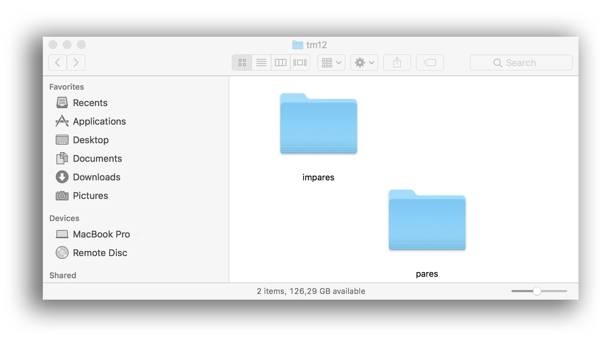

### Procedures

* Measure [lux](https://itunes.apple.com/es/app/light-meter-lux-measurement-tool/id642285909?mt=8). Best environmental light as possible. Best hours in the day: in the morning. Avoid stormy days.
* Avoid artificial light
* Avoid reflection (between the covering glass and the camera or tablet).
* Preferred device: Reflex camera with a worthy lens ~~and UV filter _add-on_~~. But this repository foster the use of a portable table (i.e.: _ipad_)
* check the available capacity on your tablet
* Only `.jpeg` file format allowed. 
* do not use `raw` file format 
* Create a `master` folder in your computer
* Create 2 folders: `pair` & `even`

* Copy those scans or photographs to the right folder that meet the former criteria
* Rotate to the `left` or `right` accordingly
* Unskew every page. Set proportions trying do not deform the image
* Unicode character set for the naming of files
* Rename files accordingly (for even and pair pages): 
    - `page001.jpeg`
    - `page003.jpeg`
    - `page005.jpeg`
    - _etc_.
* Add [metadata](Metadata.md) to every file to meet industry indexing guidelines
